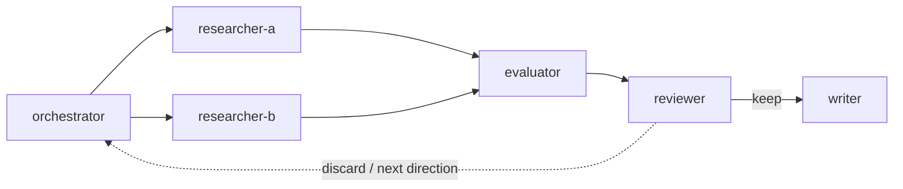

# Autonomous Research — Operational Runbook

> Multi-agent autonomous research loop. Six profiles collaborate via Hermes Kanban.
> This is the **runbook** — load it to execute. For design rationale, see the blog at [auto-alpha](https://github.com/flyer103/auto-alpha).

## When to Use

All three conditions must hold:

1. **Quantifiable evaluation metric** — a number that says "better" or "worse"
2. **Modifiable recipe** — code, config, or parameters agents can change
3. **Affordable per-experiment cost** — time/money per trial is acceptable

| Domain | Recipe | Metric | Per-Trial Cost |
|--------|--------|--------|---------------|
| Quant Strategy | `strategy.py` | Composite (Sharpe + Calmar) | ~1s backtest |
| ML Training | `train.py` | val_loss | ~5min GPU |
| Config Tuning | `config.yaml` | P99 latency | ~10s benchmark |
| Prompt Engineering | `prompt.md` | Accuracy@N | ~30s eval |

## Architecture



Six profiles, each with its own SOUL.md and config.yaml:

| Profile | Model | Role | Key Skill |
|---------|-------|------|-----------|
| `<project>-orch` | DeepSeek | Decompose, fan out tasks, manage loop | `kanban-orchestrator` |
| `<project>-res-a` | GLM-5.1 | Parameter optimization | `alpha-research` |
| `<project>-res-b` | Kimi | Factor / creative exploration | `alpha-research` |
| `<project>-eval` | DeepSeek | Independent backtest | `alpha-evaluate` |
| `<project>-review` | DeepSeek | Keep/discard, suggest direction | `alpha-review` |
| `<project>-writer` | Kimi | Research report generation | — |

See [auto-alpha](https://github.com/flyer103/auto-alpha) for complete profile configs and SOUL.md files.

---

## Phase 1: One-Time Setup

### 1.1 Create the project repo

```bash
mkdir -p ~/git/src/github.com/<user>/<project>
cd ~/git/src/github.com/<user>/<project>
git init
```

### 1.2 Create the three core files

**`program.md`** — research org charter (human edits, agents read):

```markdown
# <Project> Research Program

## Mission
<one sentence>

## Research Organization
| Role | Profile | Model | Responsibility |
|------|---------|-------|----------------|
| Orchestrator | <project>-orch | DeepSeek | Fan out tasks, manage loop |
| Researcher A | <project>-res-a | GLM-5.1 | <domain-specific> |
| Researcher B | <project>-res-b | Kimi | <domain-specific> |
| Evaluator | <project>-eval | DeepSeek | Independent testing |
| Reviewer | <project>-review | DeepSeek | Keep/discard, suggest next |
| Writer | <project>-writer | Kimi | Report generation |

## Constraints
- **Modification scope**: Only modify <recipe-file>
- **Evaluation**: <eval-file> is the single source of truth — never modify it
- **Minimum bar**: <metric> must improve to keep a change

## Research Directions
1. <direction 1>
2. <direction 2>
3. <direction 3>
```

**`evaluate.py`** — fixed harness (agents NEVER modify). Must:
- Import from the recipe file
- Run on a fixed data split (train/val/test)
- Output JSON metrics to stdout or a file

**`strategy.py`** (or equivalent recipe file) — the file agents modify. Must expose:
- A config/params dataclass agents can tune
- A `generate_signals()` or equivalent entry point
- A `get_params()` function returning current params dict

### 1.3 Create the 6 Hermes profiles

For each profile, create config.yaml and SOUL.md. Minimum config:

```yaml
# ~/.hermes/profiles/<project>-orch/config.yaml
model:
  default: deepseek-v4-pro
  provider: deepseek
agent:
  max_turns: 30
toolsets:
  - terminal
  - file
  - kanban
  - skills
skills:
  - autonomous-research
  - kanban-orchestrator
```

**Researcher profiles** need higher iteration budget (they read/write code, run tests):

```yaml
# ~/.hermes/profiles/<project>-res-a/config.yaml
model:
  default: glm-5.1
  provider: zai
agent:
  max_turns: 180
  reasoning_effort: high
toolsets:
  - terminal
  - file
  - kanban
  - skills
skills:
  - autonomous-research
  - kanban-worker
  - alpha-research
```

**Evaluator and reviewer** profiles are simpler:

```yaml
# ~/.hermes/profiles/<project>-eval/config.yaml
model:
  default: deepseek-v4-pro
  provider: deepseek
agent:
  max_turns: 30
toolsets:
  - terminal
  - file
  - kanban
skills:
  - autonomous-research
  - kanban-worker
  - alpha-evaluate
```

**SOUL.md for each profile**: See `templates/` in [auto-alpha](https://github.com/flyer103/auto-alpha/tree/main/profiles) for complete examples. Key: each SOUL.md must tell the agent its exact job and constraints, and reference its key skill.

### 1.4 Create a persistent output directory

Use a `dir:` workspace for pipeline tasks — scratch workspaces are GC'd on completion.

```bash
mkdir -p ~/git/src/github.com/<user>/<project>/research-log/experiments
```

---

## Phase 2: Run a Research Round

This is the **orchestrator runbook**. As the orchestrator, load this skill, then execute these steps in order.

### Step 2.1: Create the Kanban board

```bash
hermes kanban board create <project>
```

All subsequent `hermes kanban create` commands will use this board.

### Step 2.2: Read current state

```bash
cat ~/git/src/github.com/<user>/<project>/program.md
cat ~/git/src/github.com/<user>/<project>/research-log/baseline.json
```

Pick two research directions from `program.md` — one for each researcher.

### Step 2.3: Create researcher tasks (parallel, independent)

Use **exact** task body templates. Replace `<...>` placeholders.

```bash
# Researcher A — parameter optimization
hermes kanban create \
  "Round N: <direction-A>" \
  --assignee <project>-res-a \
  --body '## Goal
<one-sentence goal, e.g. "Tune MA window and volume threshold to improve composite score">

## Context
- Baseline composite: <score> (from baseline.json)
- Previous round: <outcome>
- Current best params: <params>

## What to Modify
Only modify `StrategyParams` in `strategy.py`. Try parameter combinations:
- <specific combos to try, e.g. MA(3,10), MA(5,20), MA(8,30)>

## Output
1. Post hypothesis as Kanban comment
2. Modify strategy.py
3. Run `uv run evaluate.py` to verify no errors
4. Complete with kanban_complete() — include params and hypothesis

## Research Log
Write findings to research-log/experiments/"

hermes kanban create \
  "Round N: <direction-B>" \
  --assignee <project>-res-b \
  --body '## Goal
<one-sentence goal, e.g. "Explore ADX trend filter to reduce false signals">

## Context
- Baseline composite: <score>
- Previous round: <outcome>
- Gaps in current strategy: <what could be improved>

## What to Modify
Modify `generate_signals()` in `strategy.py`. Try factor additions:
- <specific ideas, e.g. ADX filter, MACD confirmation, volume surge>

## Output
1. Post hypothesis as Kanban comment
2. Modify strategy.py
3. Run `uv run evaluate.py` to verify no errors
4. Complete with kanban_complete() — include hypothesis and params

## Research Log
Write findings to research-log/experiments/'
```

### Step 2.4: Wait for researchers, then check results

```bash
hermes kanban list
```

Both should show `done`. Read their `kanban_complete` summaries:

```bash
hermes kanban show <res-a-task-id> --json | jq '.runs[-1].summary'
hermes kanban show <res-b-task-id> --json | jq '.runs[-1].summary'
```

### Step 2.5: Create evaluator tasks (one per researcher)

The evaluator runs the fixed harness on each researcher's modified strategy.

```bash
hermes kanban create \
  "Evaluate R<round>-A: <brief>" \
  --assignee <project>-eval \
  --parent <res-a-task-id> \
  --workspace dir:~/git/src/github.com/<user>/<project> \
  --body '## Goal
Run independent evaluation on Researcher A'\''s strategy modification.

## Context
Researcher A'\''s task: <res-a-task-id>
Read their kanban_complete summary and comments to understand the change.

## Procedure
1. Read researcher'\''s task comments and summary
2. Read current strategy.py to verify the modification
3. Read research-log/baseline.json for baseline metrics
4. Run: `uv run evaluate.py`
5. Read the output JSON from research-log/experiments/
6. Compare to baseline, post results as Kanban comment
7. Complete with kanban_complete(metadata={...})

## Handoff Format
```json
{
  "researcher": "<res-a-task-id>",
  "hypothesis": "<what was predicted>",
  "hypothesis_confirmed": true/false,
  "metrics": { ... },
  "baseline_composite": <float>,
  "new_composite": <float>,
  "delta_composite": <float>,
  "decision": "improved|degraded|neutral"
}
```'
```

Repeat for Researcher B (change `--parent` to `res-b-task-id`).

**Important**: Use `--workspace dir:~/git/src/github.com/<user>/<project>` so the evaluator can access the modified `strategy.py` from the shared repo. Scratch workspace would start with a clean copy.

### Step 2.6: Wait for evaluators, then create reviewer

```bash
hermes kanban create \
  "Review Round N" \
  --assignee <project>-review \
  --parent <eval-a-task-id> \
  --parent <eval-b-task-id> \
  --workspace dir:~/git/src/github.com/<user>/<project> \
  --body '## Goal
Review evaluation results and make keep/discard decisions for Round N.

## Context
Evaluator A'\''s task: <eval-a-task-id>
Evaluator B'\''s task: <eval-b-task-id>
Read both evaluators'\'' kanban_complete metadata.

## Decision Rules
### Keep (promote to baseline) if:
- Composite score improved by **> 0.01** over baseline, AND
- Sharpe ratio did not decrease, AND
- Max drawdown did not worsen by > 20%, AND
- N trades >= 5

### Discard if any condition fails.

## Output
1. For each experiment, apply decision rules
2. If keep: update research-log/baseline.json
3. Post rationale as Kanban comment on each evaluator'\''s task
4. Suggest ONE next research direction
5. Complete with kanban_complete(metadata={
     "round": N,
     "experiments_reviewed": 2,
     "kept": [...],
     "discarded": [...],
     "new_baseline_composite": <float>,
     "next_direction": "<specific suggestion>"
   })
```

### Step 2.7: Wait for reviewer, then create writer

```bash
hermes kanban create \
  "Write Report Round N" \
  --assignee <project>-writer \
  --parent <review-task-id> \
  --body '## Goal
Write a research report for Round N.

## Context
Reviewer task: <review-task-id>
Read the reviewer'\''s kanban_complete metadata for decisions and metrics.

## Output Format
Write to: research-log/report_round_N.md

Include:
1. Round summary (what was tried, what worked)
2. Experiment results table (baseline vs new, delta)
3. Researcher hypotheses and whether confirmed
4. Decision rationale
5. Suggested next direction
6. Updated baseline metrics (if changed)'
```

### Step 2.8: Verify the round

```bash
# Check all tasks completed
hermes kanban list

# Check output files exist
ls -la ~/git/src/github.com/<user>/<project>/research-log/
cat ~/git/src/github.com/<user>/<project>/research-log/report_round_N.md
cat ~/git/src/github.com/<user>/<project>/research-log/baseline.json
```

If the reviewer kept a change, baseline.json should be updated — proceed to the next round.

---

## Pitfalls & Recovery

### Scratch workspace GC

**Symptom**: Downstream task can't find files the upstream task wrote.

**Cause**: Scratch workspaces (the default) are deleted on `kanban_complete`.

**Fix**: Always use `--workspace dir:<abs-path>` for pipeline tasks where downstream workers need the files. Alternatively, instruct workers to post critical output as Kanban comments.

### Writer profile iCloud path isolation

**Symptom**: Writer says it wrote to `~/Library/Mobile Documents/...` but the file isn't there.

**Cause**: Writer profiles run in an isolated home (`~/.hermes/profiles/writer/home/`). The file is written inside that sandbox.

**Fix**: After writer completes, copy the file out:
```bash
cp "~/.hermes/profiles/writer/home/Library/Mobile Documents/iCloud~md~obsidian/Documents/Obsidian/blogs/<file>.md" \
   "~/Library/Mobile Documents/iCloud~md~obsidian/Documents/Obsidian/blogs/<file>.md"
```
Or instruct writers to write to `/tmp/` and copy from there.

### Researcher iteration budget exhaustion

**Symptom**: Researcher task timed out with `Iteration budget exhausted (180/180)`.

**Cause**: Complex code modifications can exhaust the 180-turn budget.

**Fix**: The dispatcher auto-retries (halved budget, ~90 turns). The retry often succeeds because the worker re-reads its partial progress. If both attempts fail:
1. Increase `max_turns` in the profile's config.yaml (e.g., 180 → 300)
2. Restart gateway: `hermes gateway restart`
3. Clear task runs and unblock: `hermes kanban edit <id> --status todo`
4. Re-dispatch

### Evaluator runs on wrong code

**Symptom**: Evaluator reports metrics identical to baseline when researcher changed code.

**Cause**: Evaluator was assigned a scratch workspace, which starts with a clean copy of the repo at `HEAD` — not the researcher's modified version. Researcher's changes were lost on workspace GC.

**Fix**: Always assign evaluator with `--workspace dir:<path-to-repo>`. If using a worktree, make sure the researcher committed changes first:
```bash
cd <repo>
jj commit -m "round N: researcher A changes"
```

### Reviewer auto-spawns duplicate tasks

**Symptom**: After reviewer completes, there are extra Kanban tasks it created.

**Cause**: Some reviewer profiles may create their own fix tasks via `kanban_create`.

**Fix**: Archive duplicates:
```bash
hermes kanban archive <duplicate-task-id>
```

### Kanban DB corruption (macOS)

If `hermes kanban list` fails with "database disk image is malformed", run:
```bash
cp ~/.hermes/kanban.db ~/.hermes/kanban.db.bak
sqlite3 ~/.hermes/kanban.db.bak ".recover" > kanban_recover.sql
sed '/CREATE TABLE sqlite_sequence/d' kanban_recover.sql > kanban_fixed.sql
rm -f ~/.hermes/kanban.db
sqlite3 ~/.hermes/kanban.db < kanban_fixed.sql
rm kanban_recover.sql kanban_fixed.sql
```
Prevent by running gateway with: `caffeinate -i hermes gateway run`

### Two researchers edit the same file concurrently

**Symptom**: Second researcher overwrites first researcher's changes.

**Mitigation**: Each researcher should re-read `strategy.py` before modifying. The evaluator runs independently per researcher — it checks out the file at evaluation time, not at modification time. If using git, each researcher should commit first so the evaluator can check out the right revision.

Better approach: researchers modify different sections of the code (researcher A: StrategyParams; researcher B: generate_signals logic) to reduce merge conflicts.

---

## Automation: Cron

### Manual trigger (for testing)

```bash
hermes cron create "now" \
  --prompt "Load autonomous-research skill. Read ~/git/src/github.com/<user>/<project>/program.md. Run one research round: create researcher tasks, wait, then evaluator, reviewer, writer." \
  --profile <project>-orch \
  --deliver origin \
  --skills autonomous-research kanban-orchestrator
```

### Nightly schedule

```bash
hermes cron create "0 2 * * *" \
  --name "<project>-nightly" \
  --prompt "Run one autonomous research round for <project>. Read program.md, determine this round's directions, create Kanban tasks for researchers." \
  --profile <project>-orch \
  --deliver origin \
  --skills autonomous-research kanban-orchestrator
```

The cron job spawns an orchestrator session. The orchestrator creates Kanban tasks — Kanban workers are dispatched independently by the gateway, not by the cron job itself.

---

## Domain Adaptation

To adapt this pattern for a new domain, replace these three files:

| File | Quant Strategy | ML Training | Config Tuning |
|------|---------------|-------------|---------------|
| `program.md` | Strategy directions, risk constraints | Model architecture directions, training constraints | Config parameters, SLO targets |
| `strategy.py` | Signal generation + params | Model definition + hyperparams | Config template + values |
| `evaluate.py` | Backtest harness | Training + validation loop | Benchmark harness |

The six-profile orchestration pattern stays the same. Only the recipe file and evaluation harness change.

---

## Reference Implementation

**[auto-alpha](https://github.com/flyer103/auto-alpha)** — A-share quant strategy research with 6 profiles, 3 domain skills, and nightly cron.

Round 1 results: Baseline composite 1.73 → ADX + optimized MA(12,40) → 3.70 (+114%), Sharpe turned positive.

Key files to study:
- `profiles/*/SOUL.md` — role-specific agent instructions
- `skills/alpha-research/SKILL.md` — researcher procedure
- `skills/alpha-evaluate/SKILL.md` — evaluator procedure
- `skills/alpha-review/SKILL.md` — reviewer decision rules
- `program.md` — research org charter
